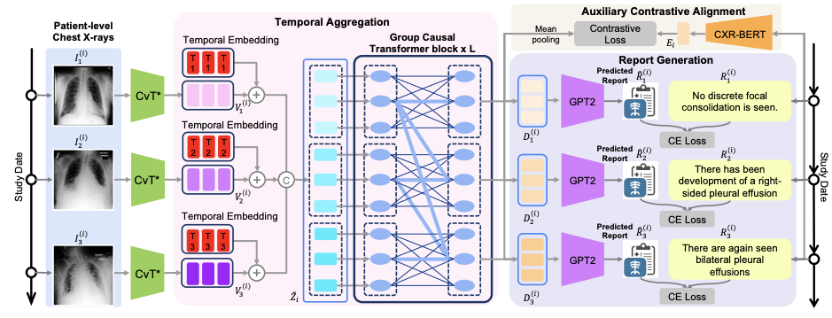

# HERGen

<b>HERGen: Elevating Radiology Report Generation with Longitudinal Data</b>, ECCV 2024.
<br><em>Fuying Wang, Shenghui Du, and Lequan Yu</em></br>

[Arxiv]() | [Cite](#cite)

**Abstract**: Radiology reports provide detailed descriptions of medical imaging integrated with patients’ medical histories, while report writing is traditionally labor-intensive, increasing radiologists’ workload and the risk of diagnostic errors. Recent efforts in automating this process seek to mitigate these issues by enhancing accuracy and clinical efficiency. However, existing automated approaches are based on a single timestamp and often neglect the critical temporal aspect of patients’ imaging histories, which is essential for accurate longitudinal analysis. To address this gap, we propose a novel History Enhanced Radiology Report Generation (HERGen) framework that employs a group causal transformer to efficiently integrate longitudinal data across patient visits. Our approach
not only allows for comprehensive analysis of varied historical data but also improves the quality of generated reports through an auxiliary contrastive objective that aligns image sequences with their corresponding reports. More importantly, we introduce a curriculum learning-based strategy to adeptly handle the inherent complexity of longitudinal radiology data and thus stabilize the optimization of our framework. The extensive evaluations across three datasets demonstrate that our framework surpasses existing methods in generating accurate radiology reports and effectively predicting disease progression from medical images.



## Updates
- 20/11/2024: The first version of HERGen code base is now alive.

## Installation
Once you clone the repo, please run the following command to create HERGen conda environment. 
```
conda create hergen python=3.10
conda activate hergen
pip install -r requirements.txt
# install our local package: hergen
pip install -e .
```

## Dataset Preparation

We are mainly using the [MIMIC-CXR v2.0.0](https://physionet.org/content/mimic-cxr/2.0.0/) dataset in our experiments. Please find download the original dataset in the PhysioNet website.

There are **3** necessary to prepare the dataset:

1. Please use the MIMIC-CXR preprocessing code in our prior work [MGCA](https://github.com/HKU-MedAI/MGCA/blob/main/mgca/preprocess/mimic_cxr.py) to extract the `master.csv` file. 

2. Download the `mimic_annotation.json` from [DCL](https://github.com/mlii0117/DCL). The annotation files are in [this link](https://drive.google.com/drive/folders/1BX_Fbs6FVeCtr6xOLdi-YHAYHAy7lCDv).

3. Using `hergen/preprocessing/create_temporal_dataset.ipynb` to create the our preoprocessed annotations. We are doing two preprocessing: 
- Only keep frontal images
- Remove duplicated images in the same study

It results in two annotations: 
`mimic_annotation.json` and `longitudinal_mimic_annotation.json` for original MIMIC-CXR and longitudinal MIMIC-CXR respectively.

## Train HERGen
We are using curriculum learning to conduct training in three stages:
(please specify `annotation_file` and `dataset_dir` of your path)

**stage 1**: Training using individual image-text pairs
```
CUDA_VISIBLE_DEVICES=0,1 python hergen/tools/train_report_generation.py --num_devices 2 --model_name cvt2distilgpt2 --batch_size 16 \
  --annotation_file ANNOTATION_FILE  --dataset_dir DATASET_DIR
```

**stage 2**: Training the model using additional contrastive alignment
```
CUDA_VISIBLE_DEVICES=0,1 python hergen/tools/train_report_generation.py --model_name clgen --batch_size 16 --num_devices 2 \
  --ckpt_path CKPT_PATH --annotation_file ANNOTATION_FILE  --dataset_dir DATASET_DIR
```
Please change the `ckpt_path` to the model path in stage 1.

**stage 3**: Training the whole framework with longitudinal information
```
CUDA_VISIBLE_DEVICES=0,1 python hergen/tools/train_report_generation.py --model_name temporal_decoder --batch_size 4 --num_devices 2 \
  --ckpt_path CKPT_PATH --annotation_file ANNOTATION_FILE  --dataset_dir DATASET_DIR
```
Please change the `ckpt_path` to the model path in stage 2.

## Acknowledgements
If you find our work useful in your research or if you use parts of our code, please cite our paper:
```
@article{wang2024hergen,
  title={HERGen: Elevating Radiology Report Generation with Longitudinal Data},
  author={Wang, Fuying and Du, Shenghui and Yu, Lequan},
  journal={arXiv preprint arXiv:2407.15158},
  year={2024}
}
```

The code for **HERGen** was adapted and inspired by the fantastic works of [R2Gen](https://github.com/cuhksz-nlp/R2Gen) , [DCL](https://github.com/mlii0117/DCL) and [cvt2distilgpt2](https://github.com/aehrc/cvt2distilgpt2).